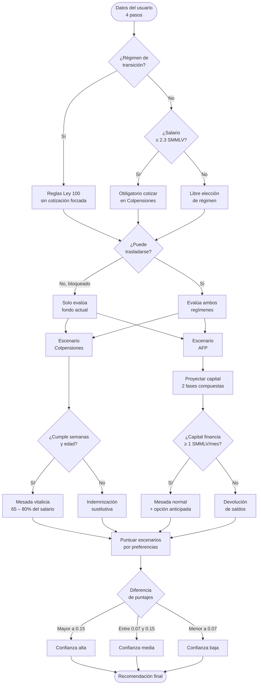

# ¿Colpensiones o AFP? · Herramienta de orientación pensional

Herramienta web para ayudar a colombianos a entender su situación pensional y orientarse entre el Régimen de Prima Media (Colpensiones) y el Régimen de Ahorro Individual con Solidaridad (AFP).

## Qué hace

Guía al usuario en 4 pasos recolectando:

1. **Datos personales** — edad, sexo biológico, fondo actual
2. **Historial de cotización** — semanas cotizadas, saldo AFP, situaciones especiales
3. **Situación laboral** — rango salarial, años laborales restantes, regularidad de cotización
4. **Factores personales** — número de hijos, prioridades (maximizar mesada, heredar, menor riesgo, etc.)

Con esa información, el algoritmo local:

- Proyecta semanas cotizadas y capital acumulado en AFP al momento del retiro
- Calcula la mesada estimada en cada régimen (en SMMLV)
- Detecta si aplica la obligatoriedad de cotizar en Colpensiones (Reforma 2024, ≤ 2.3 SMMLV)
- Identifica si el usuario está en régimen de transición (Ley 2381) o puede trasladarse
- Evalúa pensión anticipada en AFP (Art. 64, Ley 100) cuando el capital lo permite
- Pondera los escenarios según las preferencias declaradas y emite una recomendación con nivel de confianza (alta / media / baja)

Opcionalmente, el usuario puede solicitar un **análisis personalizado con IA** que genera una explicación detallada usando Claude Haiku.

## Tecnología

| Capa | Detalle |
|---|---|
| Frontend | HTML + CSS + JavaScript vanilla (sin frameworks, sin dependencias) |
| Backend IA | Netlify Function (`netlify/functions/analyze.js`) → Claude Haiku via Anthropic API |
| Hosting | Netlify (configurado en `netlify.toml`) |

## Estructura

```
pension-colombia/
├── index.html                  # Toda la UI y lógica del algoritmo (SPA)
├── netlify.toml                # Configuración de build y redirect /api/analyze
├── netlify/
│   └── functions/
│       └── analyze.js          # Serverless function que llama a la Anthropic API
└── test/
    └── algoritmo.test.js       # Tests del algoritmo (Node, sin dependencias)
```

## Despliegue en Netlify

1. Conectar el repositorio en [app.netlify.com](https://app.netlify.com)
2. En **Site settings → Environment variables**, agregar:
   ```
   ANTHROPIC_API_KEY=sk-ant-...
   ```
3. Netlify detecta automáticamente `netlify.toml` — no se requiere configuración de build adicional.

El endpoint `/api/analyze` se redirige a `/.netlify/functions/analyze` según `netlify.toml`.

## Desarrollo local

```bash
# Instalar Netlify CLI
npm install -g netlify-cli

# Crear archivo de variables locales
echo 'ANTHROPIC_API_KEY=sk-ant-...' > .env

# Levantar servidor local con funciones
netlify dev
```

La herramienta abre en `http://localhost:8888`. Sin la variable de entorno, el análisis IA muestra un error pero el algoritmo de comparación funciona igual.

## Tests

El algoritmo (proyección de semanas, escenarios Colpensiones/AFP, puntuación, régimen de transición) tiene una suite de tests sin dependencias. Para no duplicar código, el test carga el `<script>` real de `index.html` y lo evalúa en un sandbox de Node, así que siempre corre contra el código de producción.

```bash
node --test
```

Requiere Node 18+ (usa el runner integrado `node:test`). No hay paso de build ni `package.json`: la app sigue siendo un único `index.html`.

## Algoritmo y cálculos

Todo el algoritmo corre en el navegador sin necesidad de servidor. El código está íntegramente en `index.html`.

### Constantes y supuestos

El algoritmo parte de las siguientes constantes fijas: la edad legal de pensión (62 años para hombres, 57 para mujeres), las 1.300 semanas mínimas de cotización, el umbral de la Reforma 2024 de 2,3 SMMLV, una tasa de aporte del 11,5% del salario a la cuenta individual en AFP, un rendimiento conservador del 8% anual para el capital en AFP, el SMMLV 2025 de $1.423.500 COP como unidad de todos los valores monetarios, y una esperanza de vida de 80 años para hombres y 85 para mujeres.

El salario declarado en bandas se convierte al punto medio de la banda (por ejemplo, "2–3 SMMLV" se trata como 2,5 SMMLV). La frecuencia de cotización declarada cualitativamente se convierte en un factor numérico: 0,92 para quien cotiza siempre, 0,75 para frecuentemente, 0,55 para la mitad del tiempo y 0,35 para irregular.

### Verificaciones normativas previas

Antes de calcular escenarios, el algoritmo evalúa tres condiciones que pueden restringir o contextualizar la decisión.

**Régimen de transición:** Una persona está protegida si al 1 de julio de 2025 tenía 750 o más semanas cotizadas, o si en esa fecha tenía al menos 47 años (mujeres) o 52 años (hombres). Quienes cumplen esta condición quedan sujetos a las reglas de la Ley 100 de 1993, sin la obligación de cotizar en Colpensiones por nivel de ingresos que introduce la Reforma 2024.

**Obligatoriedad por reforma:** Si la persona no está en transición y su salario es igual o menor a 2,3 SMMLV, la Reforma 2024 la obliga a cotizar en Colpensiones. La herramienta lo informa pero sigue mostrando ambos escenarios para que entienda los pros y contras.

**Posibilidad de traslado:** Solo es posible cambiar de régimen si faltan más de 10 años para la edad legal de pensión. Si la persona ya se ha trasladado antes, se genera una advertencia sobre el bloqueo de 5 años entre traslados. Cuando el traslado no es posible, el algoritmo evalúa únicamente el escenario del fondo actual del usuario.

### Escenario Colpensiones (RPM)

El algoritmo proyecta las semanas totales sumando las semanas ya cotizadas más las que se acumularían durante los años laborales declarados, ponderadas por el factor de densidad. Con ese total verifica dos condiciones independientes: que la persona alcance la edad legal de pensión y que complete las semanas mínimas requeridas.

Las semanas mínimas parten de 1.300 y se reducen para mujeres con tres hijos o más (25 semanas menos) y con cuatro hijos o más (50 semanas menos adicionales sobre el descuento anterior).

Si no se cumplen ambas condiciones, el algoritmo reporta *indemnización sustitutiva* (devolución de lo cotizado en un único pago, sin mesada mensual) e indica con precisión si la restricción es de edad, de semanas, o de ambas.

Si sí se cumplen, calcula la edad exacta de retiro tomando el máximo entre la edad legal y la edad en que se completarán las semanas necesarias. La mesada se expresa como porcentaje del salario — la *tasa de reemplazo* —: parte del 65% mínimo legal y sube 1,5 puntos porcentuales por cada 50 semanas cotizadas por encima de las 1.300, con un techo del 80%. La mesada nunca puede ser inferior a 1 SMMLV.

### Escenario AFP (RAIS)

El cálculo se basa en la acumulación compuesta de capital a lo largo del tiempo en dos fases.

**Saldo inicial:** Si el usuario declaró su saldo real, se usa directamente. Si no, se estima a partir de las semanas cotizadas, el salario y la tasa de aporte, aplicando un factor que aproxima los rendimientos ya acumulados históricamente. Los independientes reciben un ajuste a la baja en la tasa de aporte efectiva, porque habitualmente cotizan sobre una base de ingreso menor a su ingreso real.

**Fase 1 — años laborales activos:** Mes a mes se aplica el rendimiento compuesto sobre el capital acumulado y se suma el aporte mensual correspondiente al salario, la tasa de aporte y la densidad de cotización. Al finalizar esta fase se agrega el bono pensional cuando aplica (trabajó en entidad pública antes de 1994).

**Fase 2 — brecha hasta la edad de pensión:** Si la persona deja de cotizar antes de la edad legal, el capital sigue rentando sin nuevos aportes hasta que llegue a esa edad.

La mesada se obtiene dividiendo el capital total entre el número de meses de vida esperada desde la edad de retiro. Si el resultado es de al menos 1 SMMLV mensual, se considera que la persona logra pensión; de lo contrario, el beneficio es la *devolución de saldos*.

**Pensión anticipada:** El algoritmo simula año a año desde la edad actual para encontrar el primer momento en que el capital ya acumulado financiaría una mesada de al menos 1,1 SMMLV. Si existe ese punto y la persona tiene al menos 50 años (mujeres) o 55 (hombres), se reporta como opción de retiro anticipado, indicando explícitamente que implica una mesada menor porque el capital debe distribuirse en más años de vida esperada.

### Puntuación y recomendación

Cada escenario recibe un puntaje compuesto sobre cinco dimensiones: probabilidad de lograr pensión, nivel de mesada, estabilidad del régimen, posibilidad de herencia y nivel de riesgo. Los pesos de cada dimensión parten de valores base y se ajustan según las prioridades declaradas por el usuario:

- **Maximizar mesada** sube el peso de la mesada.
- **Retirarme pronto** sube el peso de lograr pensión y baja el de mesada.
- **Dejar herencia** sube el peso de herencia. Las AFP permiten heredar el saldo acumulado; Colpensiones no.
- **Menor riesgo** y **Garantía del Estado** suben el peso de estabilidad y reducen el de mesada.

Los pesos se normalizan para que siempre sumen 1. La mesada se normaliza entre cero y la mesada máxima de los escenarios disponibles. Estabilidad, herencia y riesgo son puntuaciones fijas por régimen: Colpensiones puntúa alto en estabilidad y bajo en herencia; las AFP, al revés.

La diferencia entre los puntajes de los dos escenarios determina el nivel de confianza de la recomendación: **alta** si la diferencia supera 0,15, **media** entre 0,07 y 0,15, y **baja** por debajo de 0,07. Una confianza baja indica que la decisión es marginal con las preferencias declaradas y conviene consultar un asesor.

### Diagrama del flujo



---

## Contexto normativo

El algoritmo toma en cuenta:

- **Ley 100 de 1993** — requisitos base de semanas (1.300) y edades de pensión (62H / 57M)
- **Reforma Pensional 2024 (Ley 2381 de 2023)** — obligatoriedad de cotizar en Colpensiones para ingresos ≤ 2.3 SMMLV y sistema de pilares
- **Régimen de transición** — protección para personas con ≥ 750 semanas o ≥ 47/52 años al 1 de julio de 2025
- **Pensión anticipada (Art. 64, Ley 100)** — posibilidad de retiro antes de la edad legal cuando el capital AFP financia una mesada ≥ 1.1 SMMLV

> **Aviso:** Esta herramienta es orientativa. Los cálculos son aproximaciones y no reemplazan la consulta oficial con Colpensiones, la AFP, ni un asesor pensional certificado.
